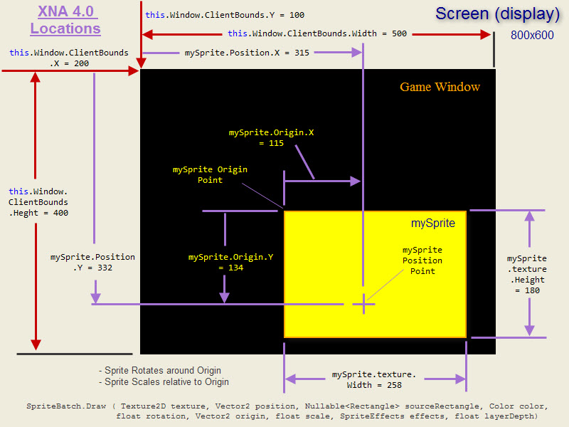

# Zofia


# Compile and run in Mac OS (Catalina@10.15)
- Install conan
- Conan profile
````
[settings]
os=Macos
os_build=Macos
arch=x86_64
arch_build=x86_64
compiler=clang
compiler.version=12
compiler.libcxx=libc++
build_type=Release

[options]
[build_requires]
[env]
````
- Run run-macos.sh

# Docs
1. Game State: http://gamedevgeek.com/tutorials/managing-game-states-in-c/
2. High performance Sprite: https://github.com/SFML/SFML/wiki/Source%3A-High-Performance-Sprite-Container
3. Delta time:
    - https://drewcampbell92.medium.com/understanding-delta-time-b53bf4781a03#:~:text=Delta%20time%2C%20or%20also%20referred,drawn%20and%20the%20current%20frame
    - https://dev.to/dsaghliani/understanding-delta-time-in-games-3olf
    - https://dev.to/dsaghliani/understanding-delta-time-in-games-3olf
4. JPEG: https://www.youtube.com/watch?v=Kv1Hiv3ox8I
5. Center Text: https://github.com/eXpl0it3r/Examples/blob/master/SFML/CenterText.cpp
6. Origin & Position: https://stackoverflow.com/questions/9108135/difference-between-origin-and-position-arguments-in-spritebatch-drawstring/9109122#




